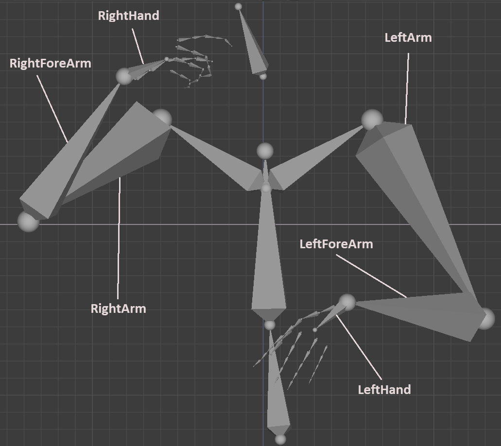
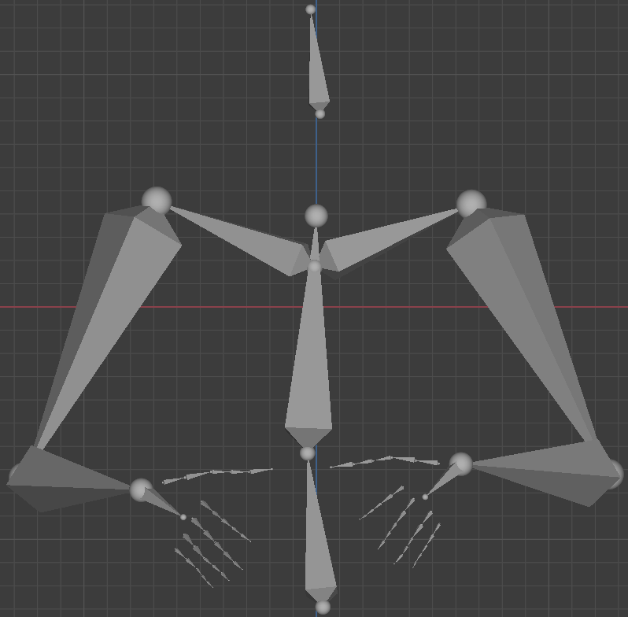
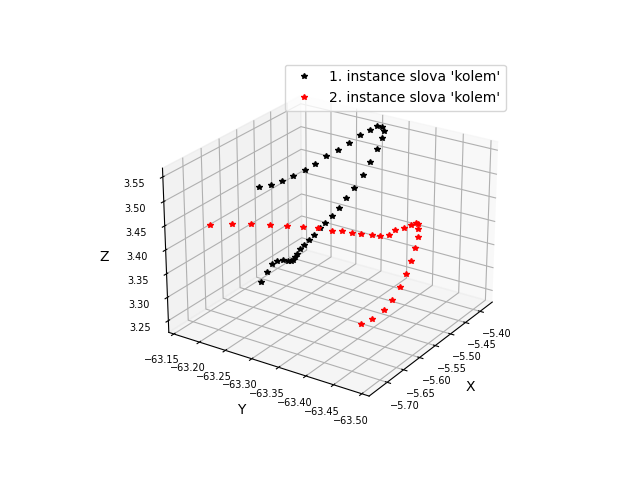
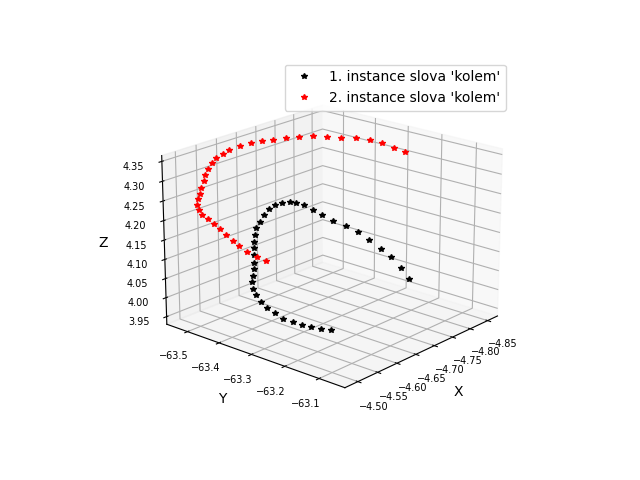
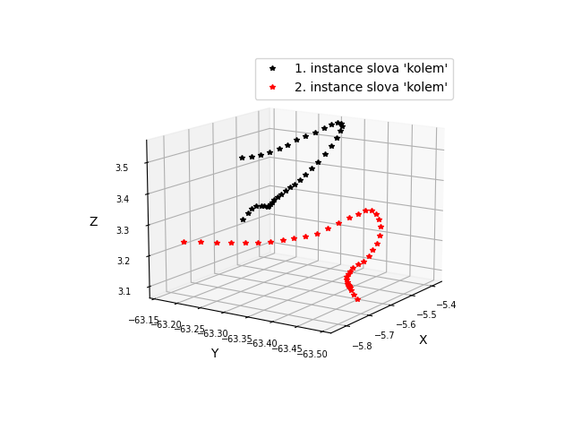

# Sign Language Motion Capture Data Analysis

 

This repository includes the code used for Sign Language Motion Capture Data Analysis bachelor's thesis development by author [Ondřej Valach](https://github.com/oValach). This thesis is accessible from [Theses](https://theses.cz/id/trmq9h/).

## About
Folders `BVwHacker`, `lib` and `other` include additional scripts called by main script `data__mining` in the repository base.

Folder `data` includes some minor data used for evaluation, `shell&run` includes executing scripts for testing purposes and `output__files` is a directory where outputs are generated to.

## Execution
For one metric setting evaluetion execute `data_mining.py` script, or just its `load()` and `compute()` functions. Check the input parameters of functions before the execution and set it up according to your needs.

  